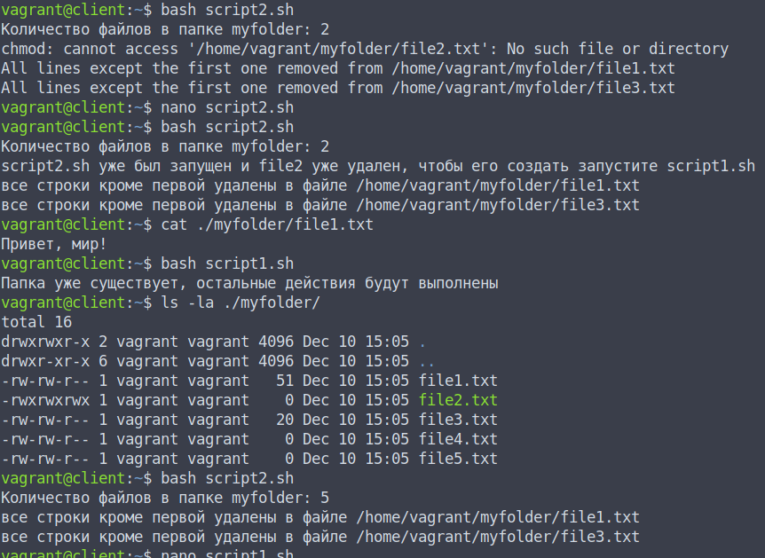

# Домашнее задание по теме Bash скрипты

## Необходимо было выполнить следующее ДЗ

Создать 2 скрипта:
− script1.sh

+ Создает папку myfolder в домашней папке текущего пользователя
+ Создает 5 файлов в папке:

    1 - имеет две строки: 1) приветствие, 2) текущее время и дата

    2 - пустой файл с правами 777

    3 - одна строка длиной в 20 случайных символов

    4-5 пустые файлы

− script2.sh

+ Определяет, как много файлов создано в папке myfolder

+ Исправляет права второго файла с 777 на 664

+ Определяет пустые файлы и удаляет их

+ Удаляет все строки кроме первой в остальных файлах

**ВАЖНО! Запуск скриптов в любой последовательности и количество запусков не должны вызывать ошибки**

## Реализация ДЗ

Разработан [script1.sh](./script1.sh):

```
#!/bin/bash
#whoami
current_user=$(whoami)

# Создаем папку myfolder в домашней папке текущего пользователя, если ее не существует
if [ ! -d /home/$current_user/myfolder ]; then
	mkdir /home/$current_user/myfolder 
else
	echo "Папка уже существует, остальные действия будут выполнены"
fi

# Создаем файл с двумя строками: приветствие и текущее время и дата
echo "Привет, мир!" > /home/$current_user/myfolder/file1.txt
echo $(date) >> /home/$current_user/myfolder/file1.txt

# Создаем пустой файл с правами 777, если его не существует
if [ ! -f  /home/$current_user/myfolder/file2.txt ]; then
	touch /home/$current_user/myfolder/file2.txt
fi
chmod 777 /home/$current_user/myfolder/file2.txt


# Создаем файл с одной строкой длиной в 20 случайных символов
tr -dc A-Za-z </dev/urandom | head -c 20 > /home/$current_user/myfolder/file3.txt

# Создаем пустые файлы 4 и 5
if [ ! -f  /home/$current_user/myfolder/file4.txt ] || [ ! -s /home/$current_user/myfolder/file4.txt ]; then
	touch /home/$current_user/myfolder/file4.txt
fi
if [ ! -f  /home/$current_user/myfolder/file5.txt ] || [ ! -s /home/$current_user/myfolder/file5.txt ]; then
	touch /home/$current_user/myfolder/file5.txt
fi
```

и разработан [script2.sh](./script2.sh):

```
#!/bin/bash
#whoami
current_user=$(whoami)

if [ -d /home/$current_user/myfolder ]; then

	# Определяем количество файлов в папке myfolder и выводим на экран
	file_count=$(ls -l /home/$current_user/myfolder | grep ^- | wc -l)
	echo "Количество файлов в папке myfolder: $file_count"

	# Исправляем права второго файла с 777 на 664
	if [ -f /home/$current_user/myfolder/file2.txt ]; then	
		chmod 664 /home/$current_user/myfolder/file2.txt
	else
		echo "script2.sh уже был запущен и file2 уже удален, чтобы его создать запустите script1.sh"
	fi
	# Определяем пустые файлы и удаляем их
	find /home/$current_user/myfolder -type f -empty -delete

	# Удаляем все строки кроме первой в остальных файлах
    	for file in /home/$current_user/myfolder/*; do
        	sed -i '2,$d' $file
        	echo "все строки кроме первой удалены в файле $file"
    	done	
else
	echo "Не существует папка ~/myfolder. Запустите сначала скрипт script1.sh"
fi
```

Разработанные скрипты запущены несколько раз в разном порядке для проверки обработки ошибок:

