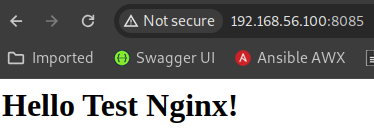

# Домашнее задание по теме ansible

## Необходимо было выполнить следующее ДЗ

1. Установка Ansible

Ansible установлен на хостовую машину

2. Работа с окружениями

- Развернуть в Vagrant две ВМ: prod и dev

Создан VagrantFile:

```
Vagrant.configure("2") do |config|
    config.vm.box = "bento/ubuntu-20.04"
    config.vm.box_check_update = false    

    config.vm.define "dev" do |dev|
      dev.vm.hostname = "dev"
      dev.vm.network "public_network", ip: "192.168.56.100"
      dev.vm.provider "virtualbox" do |vb|
        vb.gui = false
        vb.memory = "1024"
      end
    end

    config.vm.define "prod" do |prod|
      prod.vm.hostname = "prod"
      prod.vm.network "public_network", ip: "192.168.56.101"
      prod.vm.provider "virtualbox" do |vb|
        vb.gui = false
        vb.memory = "1024"
      end     
    end
end
```

- В папке lesson12 репозитория создать папку ansible/env и создать структуру для двух окружений dev и prod.

Создана структура для двух окружений:

```
┌─[pasqueque@pasqueque-comp]─[~/Documents/DevOpsCodeby/homework/lesson12/ansible]
└──╼ $tree 
.
├── ansible.cfg
├── env
│   ├── dev
│   │   ├── group_vars
│   │   └── inventory
│   └── prod
│       ├── group_vars
│       └── inventory
├── key
├── key.pub
├── playbook1.yml
├── playbooks
│   └── playbook.yml
└── template
    ├── index.html
    └── site_nginx.net

```

- Создать inventory файл в каждом из окружений dev и prod

Создан inventory для окружения [dev](./ansible/env/dev/inventory)

```
# ansible/env/dev/inventory
[web]
webserver1 ansible_host=192.168.56.100
[web:vars]
env=development
```

Создан inventory для окружения [prod](./ansible/env/prod/inventory)

```
# ansible/env/prod/inventory
[web]
webserver1 ansible_host=192.168.56.101
[web:vars]
env=productive
```

3. Создание playbook

Создать в папке ansible/playbooks playbook, который:

- устанавливает на ВМ пакеты wget, htop , nginx и запускает Nginx-сервер;

- выводит информацию о том, в каком окружении находится конфигурируемый хост ("This host is in ... environment") с помощью модуля debug

В каждом окружении создана переменная env, которая соответствует окружение (development или productive)

- Подключение к хостам выполнять с помощью SSH-key

Созданы ключи `/home/pasqueque/Documents/DevOpsCodeby/homework/lesson12/ansible/key` и `/home/pasqueque/Documents/DevOpsCodeby/homework/lesson12/ansible/key.pub` для подключения к хостам, на хосты залит публичный ключ. 

Создан [playbook](./ansible/playbooks/playbook.yml)

```
---
- name: Update servers
  hosts: all
  remote_user: vagrant
  vars:
    list_of_packages:
      - wget
      - htop
      - nginx

  tasks:
    - name: "Print debug"
      ansible.builtin.debug:
       msg: "This host is in {{ env }} environment"
 
    - name: "Update all packages"
      ansible.builtin.apt:
        update_cache: yes
      become: true
      become_method: sudo

    - name: "Installing Packages"
      ansible.builtin.apt:
        name: "{{ item }}"
      become: true
      become_method: sudo
      loop: "{{ list_of_packages }}"

    - name: "Create directory"
      file:
        path=/opt/nginx/www/site-nginx.net/html
        state=directory
      become: true
      become_method: sudo
    
    - name: "Create nginx index"
      copy:
        src: ../template/index.html
        dest: /opt/nginx/www/site-nginx.net/html/index.html
      become: true
      become_method: sudo

    - name: "Create nginx conf"
      copy:
        src: ../template/site_nginx.net
        dest: /etc/nginx/sites-available/
      become: true
      become_method: sudo

    - name: "Check symlink in site-enabled"
      ansible.builtin.stat:
        path: /etc/nginx/sites-enabled/site_nginx.net
      register: link_stat

    - name: "Create symlink if it does not exists"
      ansible.builtin.file:
        src: /etc/nginx/sites-available/site_nginx.net
        dest: /etc/nginx/sites-enabled/site_nginx.net
        state: link
      when: link_stat.stat.islnk is not defined
      become: true
      become_method: sudo
    
    - name: "Restart nginx"
      service: name=nginx state=restarted enabled=yes
      become: true
      become_method: sudo
```

Также создана папка template, где хранится конфиг nginx и html страница. После отработки плейбука nginx доступен на порту 8085:



Вывод запуска плейбука:

```
ansible-playbook -i env/prod ./playbooks/playbook.yml

PLAY [Update servers] ************************************************************************************************************************************************************************

TASK [Gathering Facts] ***********************************************************************************************************************************************************************
ok: [webserver1]

TASK [Print debug] ***************************************************************************************************************************************************************************
ok: [webserver1] => {
    "msg": "This host is in productive environment"
}

TASK [Update all packages] *******************************************************************************************************************************************************************
ok: [webserver1]

TASK [Installing Packages] *******************************************************************************************************************************************************************
ok: [webserver1] => (item=wget)
ok: [webserver1] => (item=htop)
ok: [webserver1] => (item=nginx)

TASK [Create directory] **********************************************************************************************************************************************************************
ok: [webserver1]

TASK [Create nginx index] ********************************************************************************************************************************************************************
ok: [webserver1]

TASK [Create nginx conf] *********************************************************************************************************************************************************************
ok: [webserver1]

TASK [Check symlink in site-enabled] *********************************************************************************************************************************************************
ok: [webserver1]

TASK [Create symlink if it does not exists] **************************************************************************************************************************************************
changed: [webserver1]

TASK [Restart nginx] *************************************************************************************************************************************************************************
changed: [webserver1]

PLAY RECAP ***********************************************************************************************************************************************************************************
webserver1                 : ok=10   changed=2    unreachable=0    failed=0    skipped=0    rescued=0    ignored=0  
```


4. В папке ansible создать файл ansible.cfg и определить в нем окружение по умолчанию dev

В конфигурационном файле ansible.cfg  внесены строки в начало конфига:

```
[defaults]
private_key_file = /home/pasqueque/Documents/DevOpsCodeby/homework/lesson12/ansible/key
inventory = ./env/dev/inventory
```