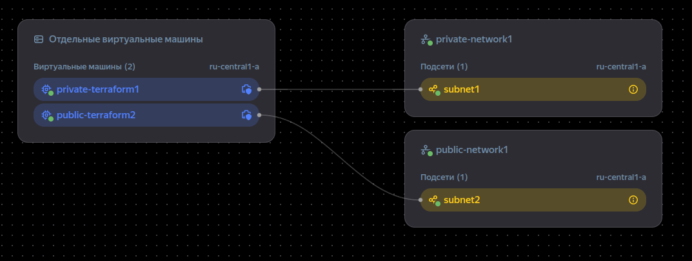
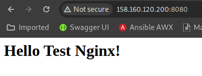
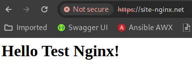
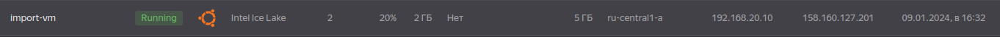
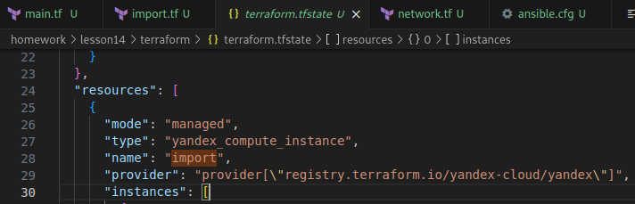

# Домашнее задание по теме terraform

## Необходимо было выполнить следующее ДЗ

1. Создать с помощью Terraform две конфигурации в любом облачном провайдере (предварительно выполнив регистрацию в облаке), имеющем Terrafrom-провайдера, которые:

    1.1. Создает две подсети private и public в VPC по умолчанию

    1.2. Создает в каждой подсети ВМ:

    - к ВМ в public разрешает подключение по ssh, http(s)
    
    - к ВМ в private разрешает подключение по ssh, 8080
    
    - устанавливает на ВМ Nginx с помощью любого провижинера terraform

2. Вручную создать ВМ в любой подсети и выполнить импорт ресурса в ранее созданную вторую конфигурацию terraform любым методом.

### Подготовка к ДЗ

Работаем по статье:
https://cloud.yandex.ru/ru/docs/tutorials/infrastructure-management/terraform-quickstart и выполняем следующие пункты:

- Регистрация платежного аккаунта

- Создание сервисного аккаунта

- Установлен terraform из зеркала: https://hashicorp-releases.yandexcloud.net/terraform/  и добавлен в PATH:

```bash
export PATH=$PATH:/path/to/terraform
```

- установлен CLI yandex:

```bash
curl -sSL https://storage.yandexcloud.net/yandexcloud-yc/install.sh | bash
```

- настроен профиль CLI согласно: https://cloud.yandex.ru/ru/docs/cli/quickstart#install

- Аутентификационные данные добавлены в переменные окружения:

```bash
export YC_TOKEN=$(yc iam create-token) #IAM-токен
export YC_CLOUD_ID=$(yc config get cloud-id) #идентификатор облака.
export YC_FOLDER_ID=$(yc config get folder-id) #идентификатор каталога
```

### Переходим к ДЗ

#### Первая часть задания

_____

1. Настройка провайдера: [providers.tf](./terraform/providers.tf)

```
terraform {
  required_providers {
    yandex = {
      source = "yandex-cloud/yandex"
    }
  }
  required_version = ">= 0.13"
}

provider "yandex" {
  zone = "ru-central1-a"
}
```

2. Cоздание двух сетей и групп безопасности: [network.tf](./terraform/network.tf)

3. Создание вирутальных машин и провижининг с помощью local-exec и ansible: [main.tf](./terraform/main.tf)

4. Через metadata и [meta.txt](./terraform/meta.txt) создается sudo пользователь и на сервера добавляется его открытый ключ.

5. Outputs вынесены в отдельный файл: [outputs.tf](./terraform/outputs.tf)

6. Для ansible создан отдельный каталог provision с плейбуками и шаблонами nginx, в самом каталоге созданы inventory и ansible.cfg.

Результат после раскатки:







#### Вторая часть задания

_____

1. Вручную создана ВМ в облаке:



2. Создан файл **import.tf**:

```
import {
    to = yandex_compute_instance.import
    id = "fh************" #id созданной ВМ
}
```

3. Выполнены следующие команды:

- `terraform plan -generate-config-out=generated.tf`

- `terraform apply`

Вывод данных команд: [output_import](./terraform/output_import.txt)

4. Импортированная машина в файле tfstate: 
