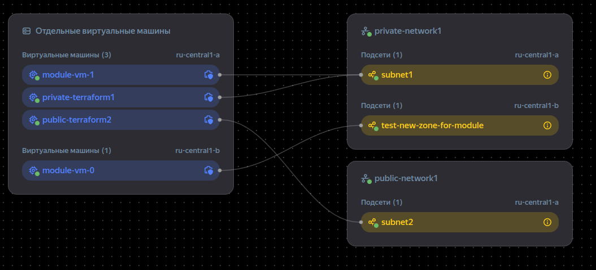

# Домашнее задание по теме модули terraform

## Необходимо было выполнить следующее ДЗ

Создать с помощью Terraform два модуля:

1. Модуль только для данных. Получает информацию о всех subnet в выбранной VPC.

2. Создает ВМ в выбранных VPC и Zone. Выбор subnet для создания ВМ должен производится
автоматически в зависимости от указанной Zone.

### Выполнение ДЗ

Создано два локальных модуля data-module и instance-vpc-zone.

Содержание модуля 
[data-module](./terraform/data-module/main.tf):

```
# Содержимое файла main.tf модуля data-module
variable "vpc-id-var-module" {
    type = string
    default = "enp24n2mde8rnblhig39"
}

data "yandex_vpc_network" "network" {
  network_id = var.vpc-id-var-module
}

data "yandex_vpc_subnet" "net-subnet" {
  for_each = toset(data.yandex_vpc_network.network.subnet_ids)
  subnet_id = each.value
}

#содержимое файла outputs.tf модуля data-module

output "nework-out" {
  value = [data.yandex_vpc_network.network.network_id, data.yandex_vpc_network.network.name]
}

output "nework-subnets" {
  value = data.yandex_vpc_network.network.subnet_ids
}

output "subnets-out" {
  value = {
    for key, subnet in data.yandex_vpc_subnet.net-subnet : 
    key => {
      name             = subnet.name
      zone             = subnet.zone
      description      = subnet.description
      v4_cidr_blocks   = subnet.v4_cidr_blocks
    }
  }
}

output "subnet-zones-module" {
  value = {
    for key, subnet in data.yandex_vpc_subnet.net-subnet: 
    key => subnet.zone
  }
}
```

 Содержание модуля [instance-vpc-module](./terraform/instance-vpc-zone/main.tf):

```terraform
#Содержимое файла main.tf модуля instance-vpc-module
variable "subnet_zones" {
  type    = map(string)
  description = "Map of subnet IDs to their zones"
  default = {
    "subnet_id1" = "ru-central1-a"
    "subnet_id2" = "ru-central1-a"
  }

}

resource "yandex_compute_instance" "vm-instance" {
  for_each    = var.subnet_zones
  name        = "module-vm-${index(keys(var.subnet_zones), each.key)}"
  zone        = each.value

  resources {
    cores  = 2
    memory = 2
    core_fraction = 20 # %
  }

    boot_disk {
      initialize_params {
        image_id = "fd8c3dv7t6prd7j4n162"
      }
  }

  network_interface {
    subnet_id = each.key
    nat       = false
  }
}

```

Модуль для данных [data-module-outputs](./terraform/data-module/outputs.tf) возвращает список всех подсетей с атрибутами. На вход модуля передается переменная vpc-id-var, содержащая id сети vpc. 

На выходе модуля в outputs возвращается атрбуты всех подсетей в сети по ее id [outputs.txt](./outputs.txt)

```
nework-out-module = {
  "nework-out" = [
    "enp**************g39",
    "private-network1",
  ]
  "nework-subnets" = tolist([
    "e2l**************tvk",
    "e9b**************mf6",
  ])
  "subnet-zones-module" = {
    "e2l**************tvk" = "ru-central1-b"
    "e9b**************mf6" = "ru-central1-a"
  }
  "subnets-out" = {
    "e2l***************tvk" = {
      "description" = ""
      "name" = "test-new-zone-for-module"
      "v4_cidr_blocks" = tolist([
        "192.168.40.0/24",
      ])
      "zone" = "ru-central1-b"
    }
    "e9b**************mf6" = {
      "description" = ""
      "name" = "subnet1"
      "v4_cidr_blocks" = tolist([
        "192.168.10.0/24",
      ])
      "zone" = "ru-central1-a"
    }
  }
}
subnet-zone-out-module = {
  "e2l**************tvk" = "ru-central1-b"
  "e9b**************mf6" = "ru-central1-a"
}
```

В модуле [instance-vpc-module](./terraform/instance-vpc-zone/main.tf) создается переменная subnet_zones описывающая структуру данных subnet_id -> zone.

Согласно этой переменной создаются машины в соответствующих зонах и подсетях в цилке for_each.

В корневом модуле  [main.tf](./terraform/main.tf) вызываем два модуля и на вход второго передаем структуру данных subnet_id -> zone из первого:

```
module "data-module-subnet-info" {
  source    = "./data-module"
  vpc-id-var-module = var.vpc-id-var
}

output "nework-out-module" {
  value = module.data-module-subnet-info
}

output "subnet-zone-out-module" {
  value = module.data-module-subnet-info.subnet-zones-module
}


 module "instance-module-vpc-auto" {
  source = "./instance-vpc-zone"
  subnet_zones = module.data-module-subnet-info.subnet-zones-module
 }
```

После применения конфигурации получаем следующий результат в инфраструктуре:

