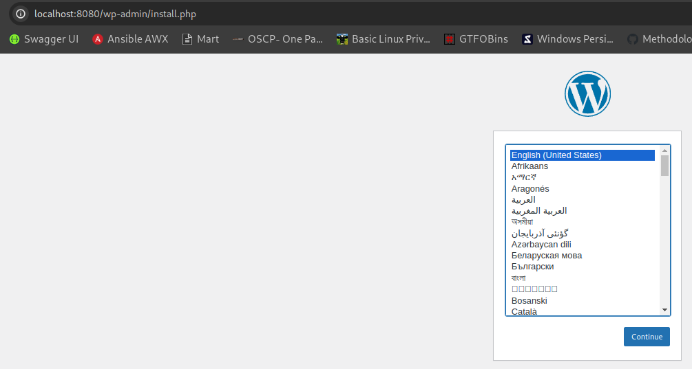

# Домашнее задание по уроку 17 - работа с docker
 
## Необходимо было выполнить следующее ДЗ

Cоздать частную bridge сеть wp-net в Docker и развернуть Wordpress в двух контейнерах:

1. Контейнер с DB MySQL

+ использует volume wp-db для хранения БД

2. Контейнер с Wordpress

+ использует volume wp-data для хранения данных wordpress

+ используется bind mount с хостовой ОС для конфигурационных файлов Apache.

В результате выполнения ДЗ подняты два контейнера, результат входа в wp: 

Для выполнения задания выполнены команды:

```
docker network create wp-net

docker volume create wp-db

docker volume create wp-data

docker run --name mysql-wp --network wp-net -p 3306:3306 -v wp-db:/var/lib/mysql -e MYSQL_ROOT_PASSWORD=P@ssw0rd_root -e MYSQL_DATABASE=wordpress -e MYSQL_USER=wordpress -e MYSQL_PASSWORD=P@ssw0rd_change_me -d mysql:8.2.0
Unable to find image 'mysql:8.2.0' locally

docker run --name wp --mount type=bind,src=/home/pasqueque/Documents/DevOpsCodeby/homework/lesson17/wp/sites-available,dst=/etc/apache2_conf -v wp-data:/var/www/html --network wp-net -e WORDPRESS_DB_USER=wordpress -e WORDPRESS_DB_PASSWORD=P@ssw0rd_change_me -e WORDPRESS_DB_NAME=wordpress -e WORDPRESS_DB_HOST=mysql-wp:3306 -p 8080:80 -d wordpress:6.4.2-php8.1-apache
```

Результат работы команды script приведен в файле: [script-log](./log-docker.log)

Результат script без ANSI символов: [script-txt](./log.txt)