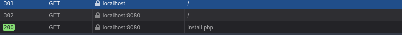
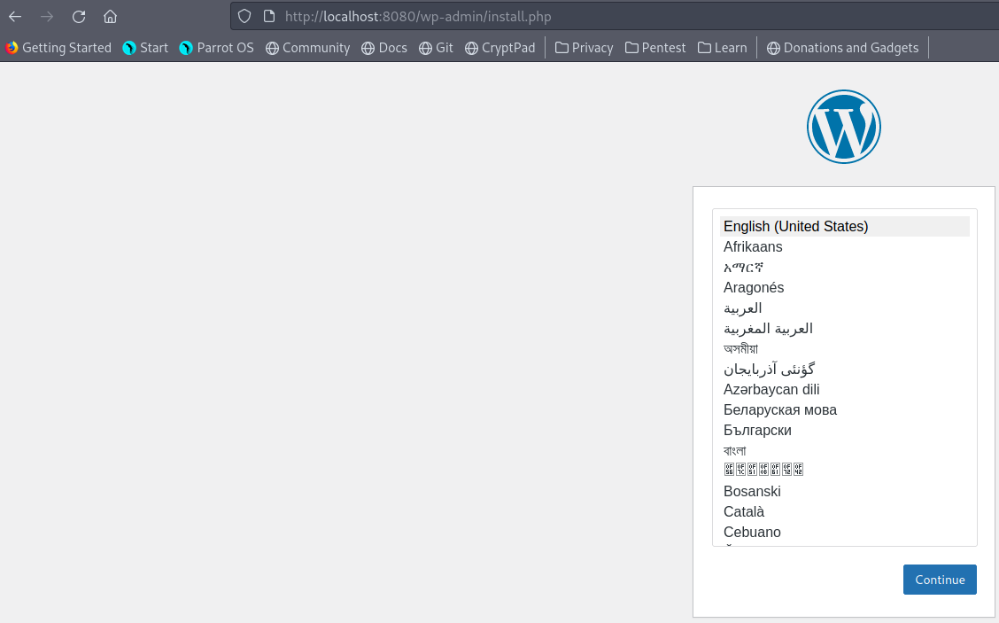

# Домашнее задание по теме docker compose

## Задание

Создать docker-compose файл для запуска проекта Wordpress, состоящего из следующих сервисов:

- db – mysql, конфиг должен быть изменяем через переменные окружения, хранилище для базы на host
машине

- app - wordpress, конфиг должен быть изменяем через переменные окружения, хранилище для каталога
Wordpress на host машине

- proxy – nginx в режиме прокси сервера, конфиг хранится на host машине

- Должны использоваться отдельные сети на backend и frontend

### Выполнение ДЗ

Создан файл [docker-compose.yml](./docker-compose.yml)

В образы передаются переменные через [mysql.env](./mysql.env)  и [wp.env](./wp.env)

Следующими командами в docker-compose.yml создаются volume и сети:

```
volumes:
  db-data:
  wp-data:

networks:
  frontend:
  backend:
```

Конфиг прокси сервера nginx задается в файле [nginx.conf](./nginx.conf) и монтируется в образ по пути /etc/nginx/conf.d/default.conf

В результате запуска контейнеров произведен вход по адресу http://localhost и получен редирект на app:8080



