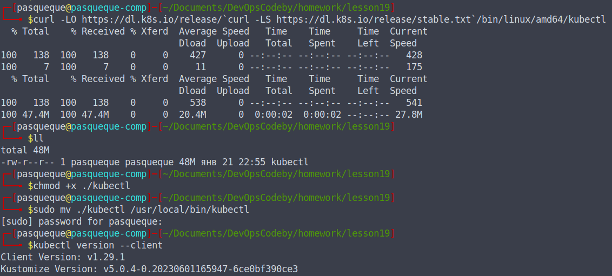
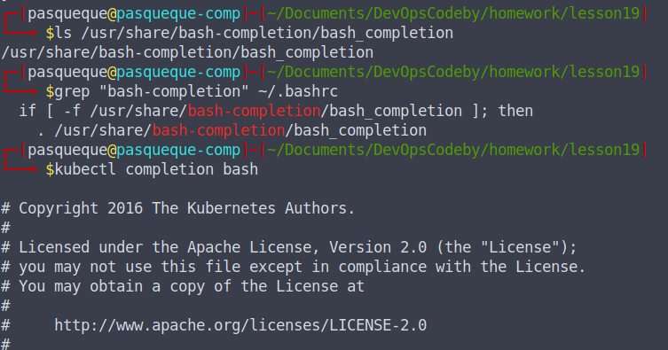
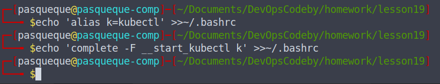
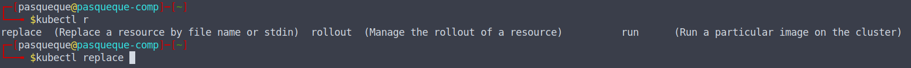
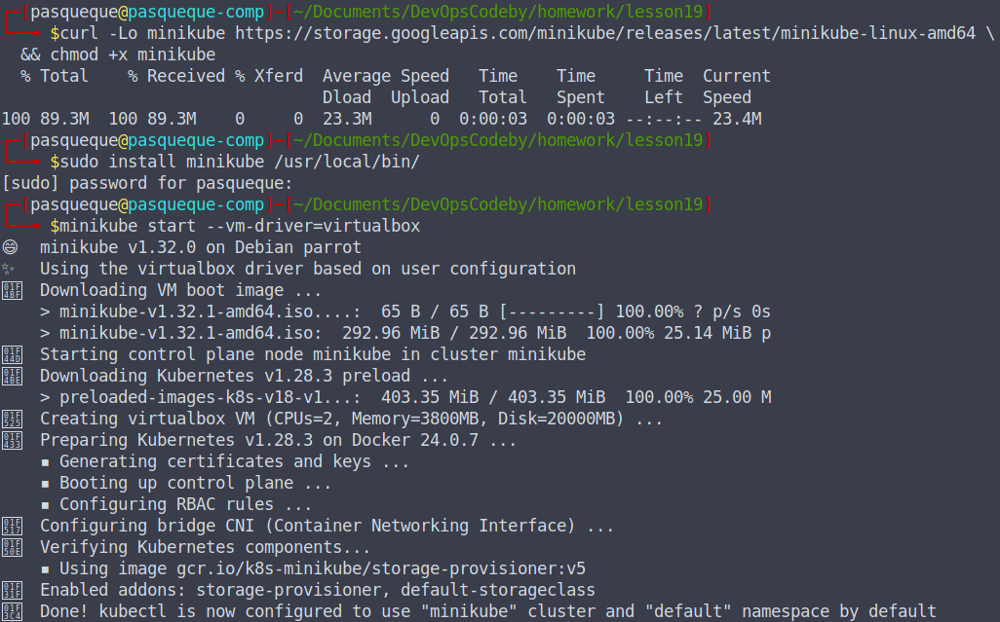
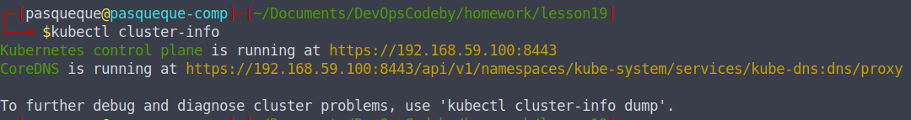
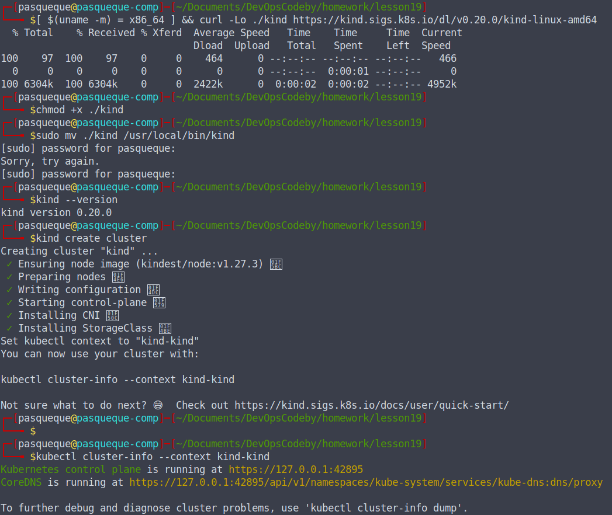

# Домашнее задание по теме Оркестрация контейнеров (kubernetes)

## Задание

1. Выполнить установку kubectl. Настроить автодополнение команд в используемой командной оболочке.

2. Выполнить установку кластера Kubernetes в локальном окружении двумя сопособами, с помощью:

+ minikube
+ kind.

Загрузить в репозиторий скриншот или лог выполнения команды для обоих развертываний: kubectl cluster-info

3. Создать в кластере Kubernetes namespace codeby и раpвернуть в нем pod с nginx методами:

+ Императивной команды
+ Императивной конфигурации
+ Декларативной конфигурации

## Выполнение задания

1. Выполнена установка kubectl.

Настроено автодополнение команд в используемой командной оболочке.

Проверен bash-completion

Установлено автодополнение

2. Установлен minikube и kind

3. В кластере minikube создан namespace и тремя способами создан pod с nginx:

[log.txt](./log.txt) ([log_without_ansi](./logs_without_ansi.txt))

Конфигурационный файл для Императивной конфигурации - [nginx.yaml](./nginx.yaml)

Конфигурационый файл для Декларативной конфигурации - [configs-nginx](./configs/nginx.yaml)

