# Домашние задание по уроку 4 - РАБОТА С ОПЕРАЦИОННОЙ СИСТЕМОЙ LINUX

## Изменить конфигурацию ОС

- изменить hostname

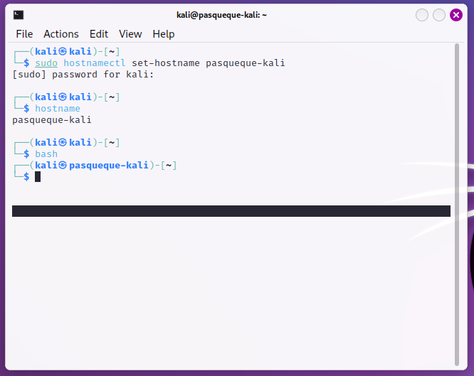

> При изменении hostname также необходимо менять /etc/hosts

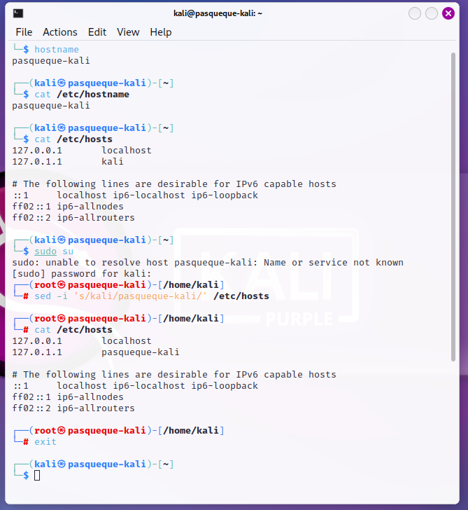

- изменить timezone

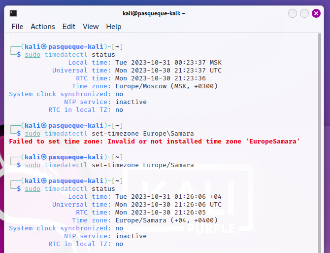

- установить любой баннер при логине пользователя (MOTD)

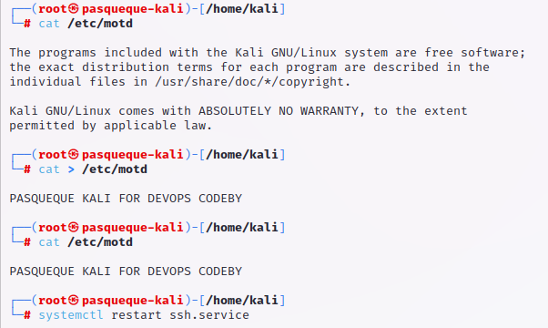

## Подключение к ВМ через SSH с напечатанным выводом MOTD

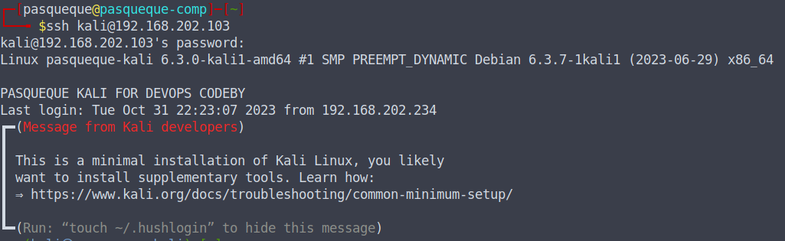

## Вывод системной информации о

- версии ядра

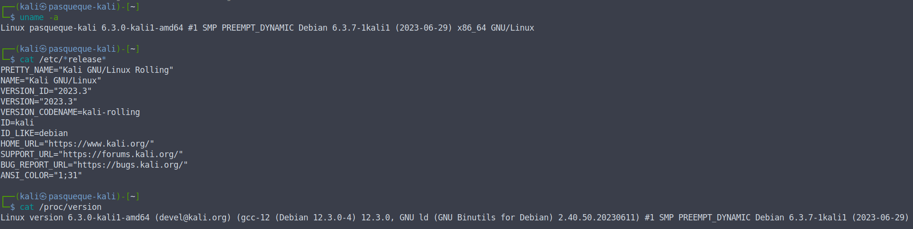

- модулях ядра (loaded and active)

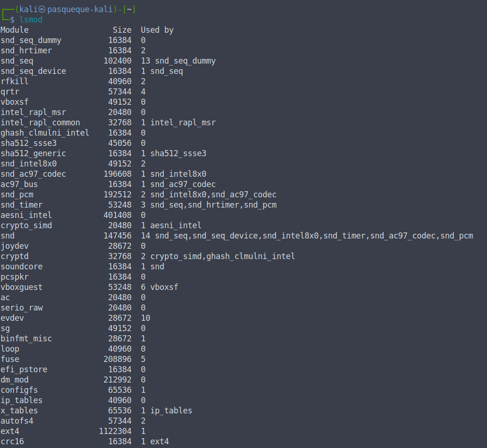

- информации о ресурсах (CPU and Memory)

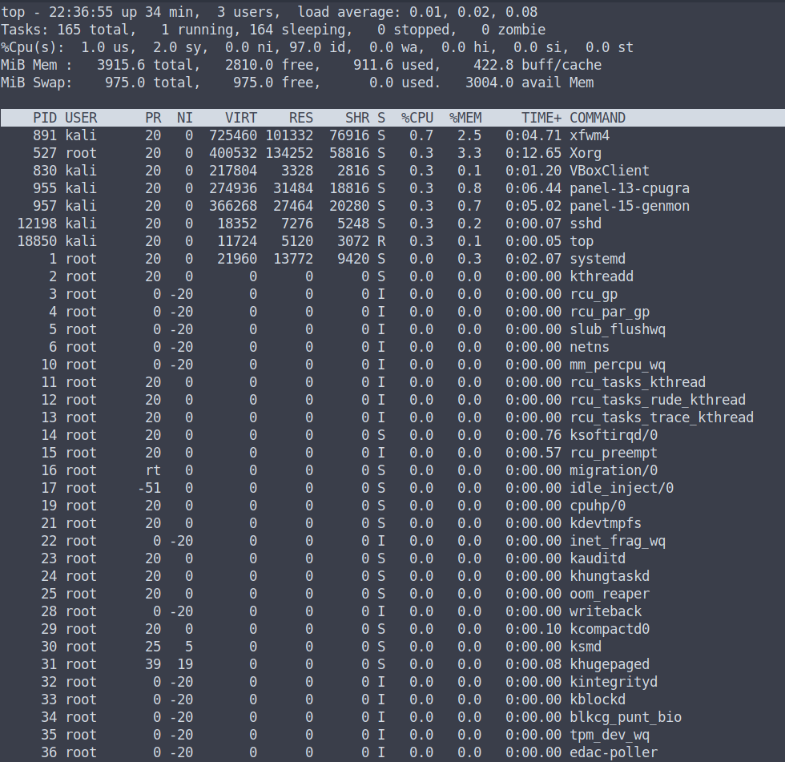

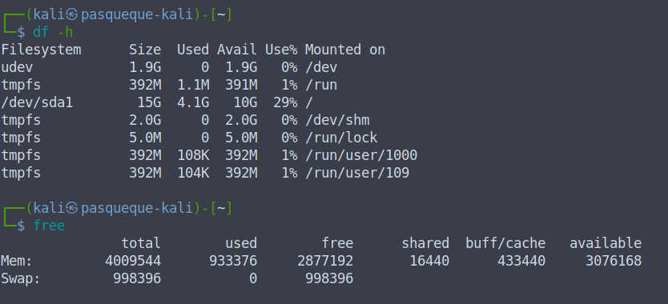

- информации о пользователях и группах

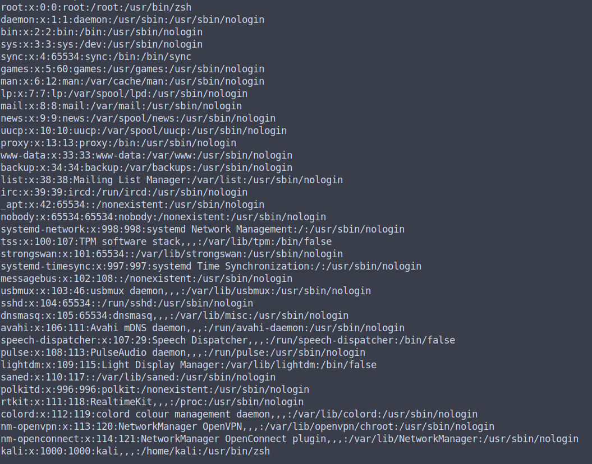

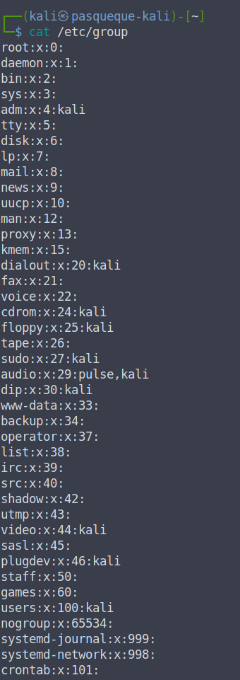

## Залогировать с помощью утилиты script

- вывод всех процессов в системе

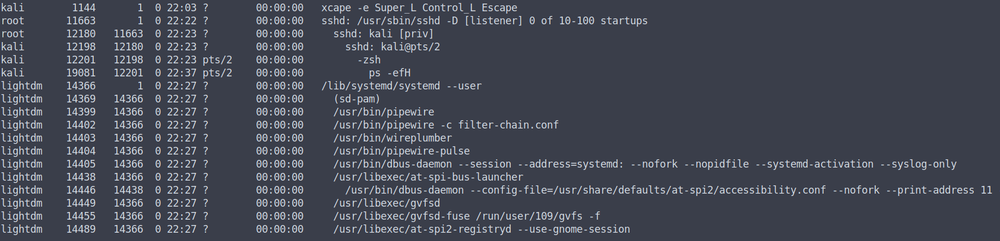

- вывод всех процессов для своего пользователя
- запуск процесса top в background
- остановку процесса top, работающего в background

Лог файл утилиты script: [ps-log](./ps-log.txt)

## Установить две различные версии java jdk

- из пакетного репозитория

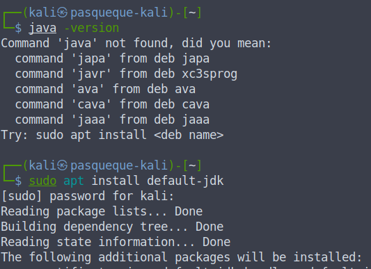

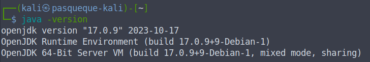

- из архива, скаченного из Интернет

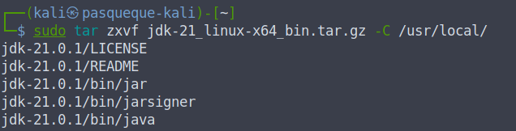

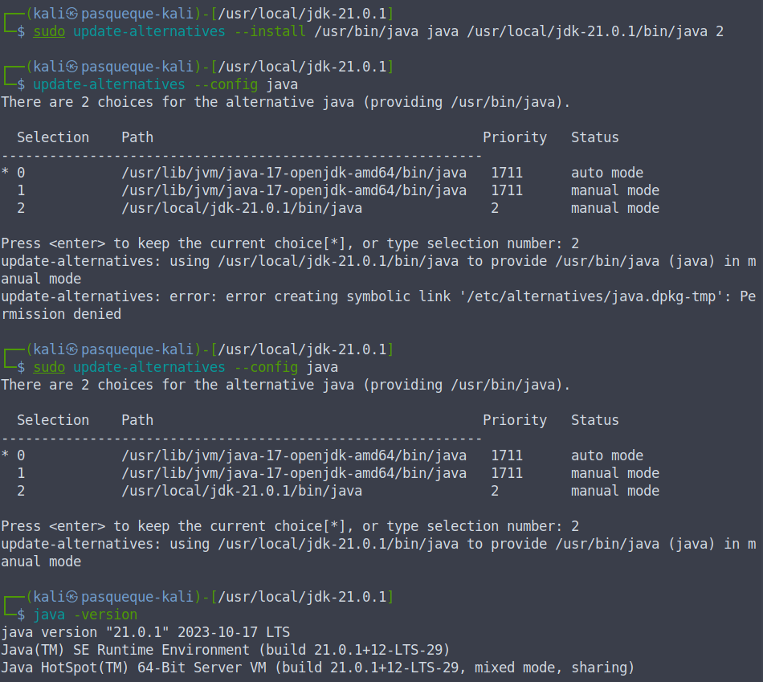

Записан с помощью утилиты script лог-файл выполнения команды java -version и переключения
между версиями: [java-log](./java-log.txt)

## Установить nginx

- выключить и убрать из автозапуска имеющийся Nginx-сервис (если есть)

> После установки через apt он выключен и в статусе disabled

- добавить свой unit-файл для запуска Nginx в качестве сервиса

> Unit - файл создан при установке, поэтому свой не добавлялся

- добавить Nginx-сервис в автозапуск

> Сервис добавлен через systemctl enable

Лог Nginx: [nginx_log](./nginx-log.txt)
