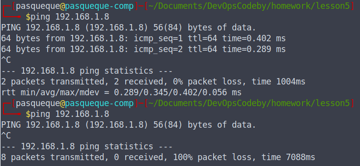

# Домашнее задание по уроку Компьютерные сети

## Ответы на тест

[answers.md](./answers.md)

## Работа с iptables и запретом подключений по ssh

### Iptables

Добавление правила на запрет Ping


Проверка `ping` до и после настроек:



Сохранение правил iptables:


После перезагрузки правила обнуляются, можем вручную восстановить их из файла или настроить это автоматически. Ниже приведен пример ручного восстановления правил iptables:


Правила на запрет `ping`: [iptables.rules](./iptables.rules)

### Настройка SSH подключений

По умолчанию ssh подключение разрешено. Если добавить в файл /etc/hosts.deny строку `sshd: ALL`, то произойдет запрет подключения по ssh:


Для того, чтобы разрешить подключение из внутренней сети, редактируем файл `/etc/hosts.allow`


## Настройка OpenVPN

Для настройки openvpn необходимо также настроить Iptables ([add_rules_ovpn](./add-openvpn-rules.sh)):

```
iptables -t nat -I POSTROUTING 1 -s 10.8.0.0/24 -o enp0s3 -j MASQUERADE
iptables -I INPUT 1 -i tun0 -j ACCEPT
iptables -I FORWARD 1 -i enp0s3 -o tun0 -j ACCEPT
iptables -I FORWARD 1 -i tun0 -o enp0s3 -j ACCEPT
iptables -I INPUT 1 -i enp0s3 -p udp --dport 1194 -j ACCEPT
```

Конфигурационный файл сервера: [server.conf](./server.conf)

Конфигурационный файл клиента: [add_rules_ovpn](./kaliclient.ovpn)

После настройки получаем подключение к сети Интернет через наш OpenVPN сервер:


Проверка соединения:


