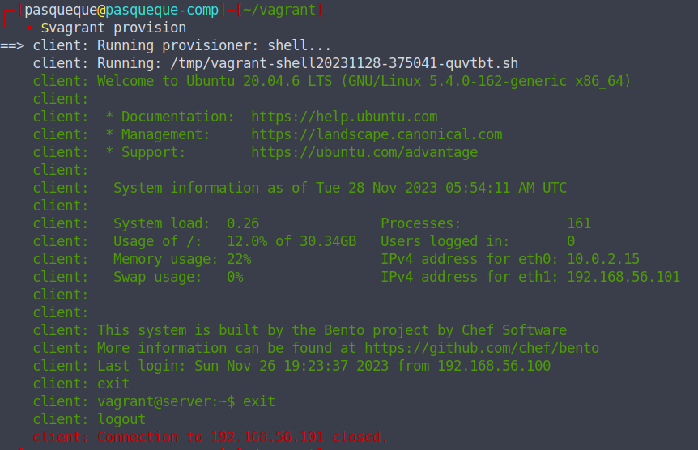

# Домашнее задание по уроку 6

## 1. LXD контейнеры

### Запустить LXD контейнер в Linux на основе любой ОС

1. Установка lxd

2. Инициализация lxd

3. Удаленные репозитории

4. Просмотр образов в репозитории:

5. Информация об образе:

6. Создание контейнера:

7. Создание контейнера:

8. Выполнение команд в контейнере:

### Установить в контейнере веб-сервер Apache

В контейнере установлен apache2 и проверено подключение из хостовой машины:

## 2. Vagrant

### Создать multi-machine Vagrantfile для запуска двух ВМ client и server на основе любых Vagrant Box.

- Установка vagrant из deb-пакета

- Инициализация vagrant, выбраны настройки по умолчанию и проинициализирован VagrantFile.

- Vagrantfile изменен для создания multi-machine client и server: [Vagrantfile](./Vagrantfile)

### Написать такой shell-скрипт для провижининга ВМ, который позволит после старта машин войти на ВМ client через команду vagrant ssh client , а уже из консоли client подключиться к ВМ server c помощью ssh-key по команде ssh -i <path_private_key_file> server

Написать полностью последовательное подключение именно с помощью provision не получается, можно последовательно подключаться через ssh -J или c вложенной командой `vagrant ssh -c "ssh -o \"StrictHostKeyChecking no\" -i /vagrant/.vagrant/machines/server/virtualbox/private_key -l vagrant 192.168.56.101" client`, которая сначала подключается к клиенту через vagrant ssh, а затем оттуда выполняется команда подключения к server по кзакрытому ключу.

В рамках provision просто реализовано подключение к server от client по ssh:

