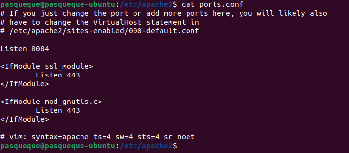
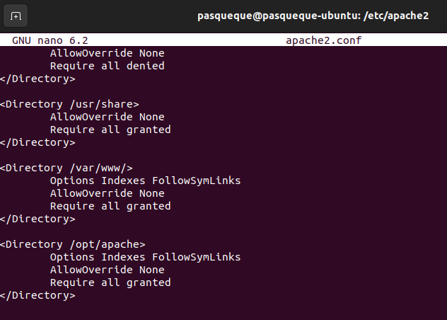

# Домашнее задание по теме Web-серверы

1. Установлены Apache и Nginx на машину

```
sudo apt update
sudo apt install apache2
sudo apt install nginx
```

2. Cоздатны папки для размещения контента веб-сайтов /opt/nginx/www/site-nginx.net/html/ и /opt/apache/www/site-apache.net/html/

3. html страницы: 
- в папке сервера apache размещен файл [test.html](./test.html)
- в папке сервера nginx размещен файл [index.html](./index.html)
 
4. Настройка apache

Создана конфигурация сервера [site-apache.net.conf](./site-apache.net.conf.txt) на порту 8084 :

```
<VirtualHost *:8084>
        ServerAdmin admin@site-apache.net
        DocumentRoot /opt/apache/www/site-apache.net/html
        ErrorLog ${APACHE_LOG_DIR}/error.log
        CustomLog ${APACHE_LOG_DIR}/access.log combined
</VirtualHost>
```

Подправлен файл ports.conf:



Добавлена директория /opt/apache в файл /etc/apache2/apache2.conf:



После чего сервер apache успешно запущен на 8084 порту:


5. Настройка nginx

Создана конфигурация сервера [site-nginx.net](./site_nginx.net) на порту 8085:

```
server {
	listen 8085;
        index index.html;
        server_name site-nginx.net;
        location / {
        	root /opt/nginx/www/site-nginx.net/html;
        }
}
```

