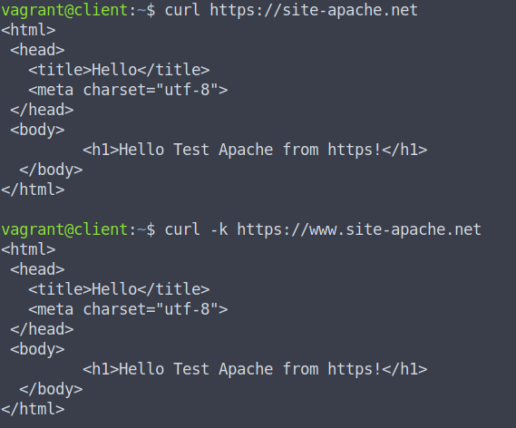

# Домашнее задание по уроку 8 - Безопасность веб-сервера

## 1. Создать Vagrantfile для развертывания двух ВМ: client и server

Создан [Vagrantfile](./webservers/Vagrantfile) со следующим содержимым:

```
Vagrant.configure("2") do |config|
    config.vm.box = "bento/ubuntu-20.04"
    config.vm.box_check_update = false    

    config.vm.define "server" do |server|
      server.vm.hostname = "server"
      server.vm.network "public_network", ip: "192.168.56.101"
      server.vm.provider "virtualbox" do |vb|
        vb.gui = false
        vb.memory = "1024"
      end
      server.vm.provision "shell", path: "./scripts/ssl_webserver.sh"
    end

    config.vm.define "client" do |client|
      client.vm.hostname = "client"
      client.vm.network "public_network", ip: "192.168.56.100"
      client.vm.provider "virtualbox" do |vb|
        vb.gui = false
        vb.memory = "1024"
      end     
      client.vm.provision "shell", path: "./scripts/client_hosts_ca_cert_added_to_https.sh"
    end
end
```

С помощью Vagrant создаются две машины ubuntu-20.04, им назначаются соответствующие ip адреса и запускаются скрипты провижининга.

## 2. На ВМ server установить веб-сервер Apache

Установка веб-сервера Apache2 выполняется в скрипте [ssl_webserver.sh](./webservers/scripts/ssl_webserver.sh).

## 3. Создать домен <name>.local и сделать его доступным через /etc/hosts на client

В рамках задания создается домен site-apache.net. Для того, чтобы сделать его доступным по доменному имени: в /etc/hosts машины client с помощью скрипта провижининга прописывается соответствующая запись.

Скрипт провижининга для клиента: [client_hosts_ca_cert_added_to_https.sh](./webservers/scripts/client_hosts_ca_cert_added_to_https.sh)

## 4. Создать с помощью OpenSSL self-signed сертификат для домена

self-signed сертификат создается в скрипте [ssl_webserver.sh](./webservers/scripts/ssl_webserver.sh).

## 5. Добавить сертификат на веб-сервер и настроить прослушивание HTTPS

Настройка HTTPS выполнена в заготовленном конфиге сайта apache [site-apache.net.conf](./webservers/site-apache.net.conf)

## 6. Создать перенаправление с HTTP на HTTPS и Создать перенаправление с www.<name>.local на <name>.local

в конфиге сайта apache [site-apache.net.conf](./webservers/site-apache.net.conf) созданы перенаправления по протоколам http и https на https[:]//site-apache[.]net

## 7. Сделать self-signed SSL сертификат доверенным на client

Самоподписанный сертификат добавлен в доверенные на клиенте с помощью [client_hosts_ca_cert_added_to_https.sh](./webservers/scripts/client_hosts_ca_cert_added_to_https.sh)

## Итоговое подключение к сайту после запуска машин через vagrant up:

