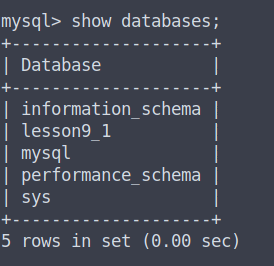
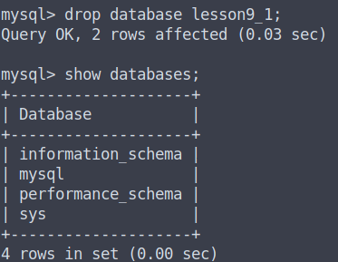
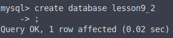
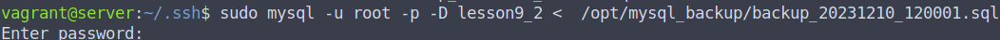
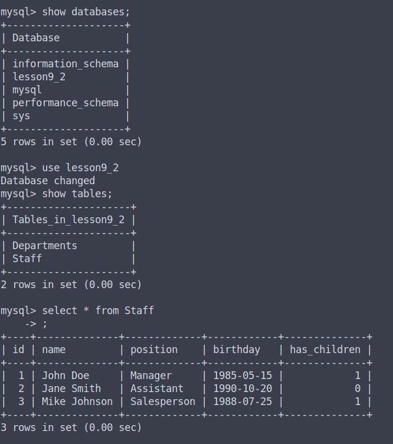

# Домашняя работа. Базы данных.

## 1. Развернуть две ВМ: server и store

С помощью vagrant развернуты обычные две ubuntu (server и client). (Далее по заданию store - это машина client)

## 2. На server:
• Установить MySQL

```
vagrant@server:~$ sudo apt update
vagrant@server:~$ sudo apt install mysql-server mysql-client
vagrant@server:~$ sudo mysqladmin password -u root -p
Enter password: 
New password: 
Confirm new password: 
Warning: Since password will be sent to server in plain text, use ssl connection to ensure password safety.
vagrant@server:~$ sudo mysql_secure_installation
```

• Создать базу

```
vagrant@server:~$ sudo mysql -u root -p

mysql> create database lesson9_1;
Query OK, 1 row affected (0.01 sec)
```

• Создать несколько таблиц и наполнить данными

```
mysql> use lesson9_1
Database changed

mysql> CREATE TABLE Staff (
    ->     id INT PRIMARY KEY AUTO_INCREMENT,
    ->     name VARCHAR(255) NOT NULL,
    ->     position VARCHAR(30),
    ->     birthday DATE NOT NULL,
    ->     has_children BOOLEAN DEFAULT(FALSE) NOT NULL
    -> );
Query OK, 0 rows affected (0.03 sec)

mysql> INSERT INTO Staff (name, position, birthday, has_children) 
    -> VALUES ('John Doe', 'Manager', '1985-05-15', TRUE),
    ->        ('Jane Smith', 'Assistant', '1990-10-20', FALSE),
    ->        ('Mike Johnson', 'Salesperson', '1988-07-25', TRUE);
Query OK, 3 rows affected (0.01 sec)
Records: 3  Duplicates: 0  Warnings: 0

mysql> CREATE TABLE Departments (
    ->   department_id INT PRIMARY KEY,
    ->   department_name VARCHAR(50),
    ->   head_count INT,
    ->   staff_id INT,
    ->   FOREIGN KEY (staff_id) REFERENCES Staff(id)
    -> );

mysql> INSERT INTO Departments (department_id, department_name, head_count, staff_id)  VALUES  (1, 'HR', 10, 1), (2, 'Finance', 15, 2), (3, 'Marketing', 12, 3);
Query OK, 3 rows affected (0.01 sec)
Records: 3  Duplicates: 0  Warnings: 0

mysql> select * from Departments;
+---------------+-----------------+------------+----------+
| department_id | department_name | head_count | staff_id |
+---------------+-----------------+------------+----------+
|             1 | HR              |         10 |        1 |
|             2 | Finance         |         15 |        2 |
|             3 | Marketing       |         12 |        3 |
+---------------+-----------------+------------+----------+
3 rows in set (0.00 sec)

mysql> select * from Staff;
+----+--------------+-------------+------------+--------------+
| id | name         | position    | birthday   | has_children |
+----+--------------+-------------+------------+--------------+
|  1 | John Doe     | Manager     | 1985-05-15 |            1 |
|  2 | Jane Smith   | Assistant   | 1990-10-20 |            0 |
|  3 | Mike Johnson | Salesperson | 1988-07-25 |            1 |
+----+--------------+-------------+------------+--------------+
3 rows in set (0.00 sec)
```

• Создать скрипт для бэкапа раз в час (бэкап в дерикторию /opt/mysql_backup) (конечно в такой реализации гигантский минус хранения пароля в открытом виде, но как это решить скриптом не понятно)

```
vagrant@server:~$ cat backup_mysql.sh 
#!/bin/bash
# Скрипт для бэкапа базы данных MySQL

mkdir -p /opt/mysql_backup

# Задаем переменные
DB_USER=root
DB_PASS=P@ssw0rd
DB_NAME=lesson9_1
DB_FILE=/opt/mysql_backup/backup_$(date +%Y%m%d_%H%M%S).sql

# Выполняем бэкап
mysqldump -u $DB_USER -p$DB_PASS $DB_NAME > $DB_FILE
```

Даллее этот скрипт помещаем в cron:

```
crontab -e
*/60 * * * * sudo bash /home/vagrant/backup_mysql.sh
```

и проверим:

```
vagrant@server:~$ sudo bash ./backup_mysql.sh 
mysqldump: [Warning] Using a password on the command line interface can be insecure.
vagrant@server:~$ ll /opt/mysql_backup/
total 12
drwxr-xr-x 2 root root 4096 Dec  9 11:55 ./
drwxr-xr-x 4 root root 4096 Dec  9 11:55 ../
-rw-r--r-- 1 root root 3096 Dec  9 11:55 backup_20231209_115528.sql
```

• Настроить синхронизацию через утилиту rsynс в папку /opt/store/mysql на ВМ store

можем синхронизировать данные просто через команду rsync и задачу cron с машины server на store

```
vagrant@server:~/.ssh$ rsync -azvre "ssh -i /vagrant/.vagrant/machines/client/virtualbox/private_key" /opt/mysql_backup/ 192.168.56.100:/opt/store/mysql
sending incremental file list
./
backup_20231209_115528.sql
backup_20231209_120001.sql
backup_20231209_180001.sql
backup_20231209_190001.sql
backup_20231209_200001.sql
backup_20231210_070001.sql
backup_20231210_120001.sql

sent 7,684 bytes  received 152 bytes  5,224.00 bytes/sec
total size is 21,672  speedup is 2.77
```

А можем настроить демон rsync и забирать данные уже через крон c машины store.
Конфигурация демона:

```
pid file = /var/run/rsyncd.pid
lock file = /var/run/rsync.lock
log file = /var/log/rsync.log
[share]
path = /opt/mysql_backup
hosts allow = 192.168.56.100
hosts deny = *
list = true
uid = vagrant
gid = vagrant
read only = false
```

Забираем данные с server из машины store:

```
vagrant@client:/opt/store/mysql$ rsync -av rsync://vagrant@192.168.56.101:873/share /opt/store/mysql
receiving incremental file list
./
backup_20231209_115528.sql
backup_20231209_120001.sql
backup_20231209_180001.sql
backup_20231209_190001.sql
backup_20231209_200001.sql
backup_20231210_070001.sql
backup_20231210_120001.sql

sent 160 bytes  received 22,230 bytes  44,780.00 bytes/sec
total size is 21,672  speedup is 0.97
```

• Проверить восстановление (предварительно удалив базу)










